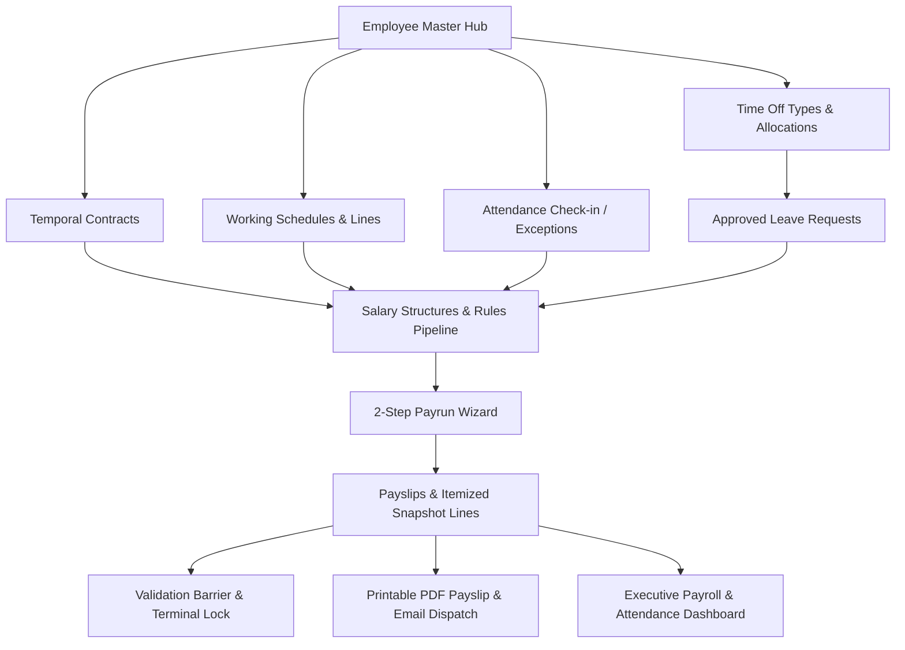

# PeoplePay360: Integrated HR & Payroll Platform Implementation Plan

> **For agentic workers:** REQUIRED SUB-SKILL: Use superpowers:subagent-driven-development (recommended) or superpowers:executing-plans to implement this plan task-by-task. Steps use checkbox (`- [ ]`) syntax for tracking.

**Goal:** Build the complete, fully integrated PeoplePay360 HR & Payroll platform matching the hackathon specification and interactive Excalidraw mockup, linking Employee Hub, Contracts, Working Schedules, Attendance Tracking (with exceptions/overtime/check-ins), Time Off Allocations & Requests, Sequenced Salary Rules & Structure Engine, 2-Step Payrun Wizard, Payslip PDF Generation & Email Dispatch, and live Executive Analytics.

**Architecture:** 
- **Backend:** FastAPI modular monolith (`master_data`, `payroll`, `analytics`, and `attendance`) backed by SQLAlchemy models with shared declarative Base, Pydantic schemas, and transaction-safe business services.
- **Frontend:** React 18 + TypeScript + Vite + Tailwind CSS + Lucide Icons + Recharts, organized into clean domain pages (`master-data`, `payroll`, `attendance`, `dashboard`), shared layout shells (`TopNavBar`, `RoleContext`, `AppShell`), and printable PDF components.
- **Data Model:** Centralized Employee hub connecting to temporal Contracts, Working Schedules with daily lines, Attendance check-in/out logs, Time Off types & Allocations/Requests, Salary Structures & sequenced Rules, and Payruns/Payslips with immutable snapshot line items.

**Tech Stack:** FastAPI, Python 3.12, SQLAlchemy, Pydantic, React 18, TypeScript, Vite, Tailwind CSS, Recharts, Lucide-React.

---

## Global Constraints

- **Single Shared Metadata Registry:** All SQLAlchemy models across modules share `server.modules.master_data.database.Base` to guarantee foreign-key resolution across tables.
- **Temporal Contract Validation:** Payrun calculations must select only contracts whose `start_date <= period_end AND (end_date IS NULL OR end_date >= period_start)`.
- **Validation Barrier:** Payruns with payslips containing `has_warning = True` cannot transition to `validated` or `paid`.
- **Terminal Lock:** Paid payruns and payslips are permanently immutable (no recalculation, state transition, or deletion).
- **Atomic Leave Deduction:** Leave requests approval locks allocation quota with `with_for_update()` and deducts days atomically.
- **Role-Based Access Control:** 5 supported roles: `Admin`, `HR Manager`, `HR Payroll User`, `HR Payroll Manager`, `Employee`.

---

## Proposed Changes & Tasks



---

### Task 1: Working Schedule Line Patterns & Dynamic Hours Calculator

**Files:**
- Modify: `server/modules/master_data/models.py`
- Modify: `server/modules/master_data/schemas.py`
- Modify: `server/modules/master_data/services.py`
- Modify: `server/modules/master_data/router.py`
- Test: `server/modules/master_data/test_master_data.py`

**Interfaces:**
- Consumes: `WorkingSchedule` base model.
- Produces: `WorkingScheduleDay` line model (day_of_week: 0-6, start_time: str, end_time: str, break_hours: float), dynamic weekly hours sum property.

- [ ] **Step 1: Write the failing test in `test_master_data.py`**

```python
def test_schedule_daily_lines_and_auto_hours():
    # Test creating schedule with Monday-Friday 9:00-17:00 with 1h break = 35h/week auto-calculated
    pass
```

- [ ] **Step 2: Run test to verify it fails**

Run: `python server/modules/master_data/test_master_data.py`
Expected: FAIL

- [ ] **Step 3: Implement `WorkingScheduleDay` line items and auto-calculation logic**

```python
class WorkingScheduleDay(Base):
    __tablename__ = "working_schedule_days"
    id = Column(Integer, primary_key=True, index=True)
    schedule_id = Column(Integer, ForeignKey("working_schedules.id", ondelete="CASCADE"), nullable=False)
    day_of_week = Column(Integer, nullable=False)  # 0=Monday, 6=Sunday
    start_time = Column(String(5), nullable=False, default="09:00")
    end_time = Column(String(5), nullable=False, default="18:00")
    break_hours = Column(Numeric(4, 2), default=1.00, nullable=False)
    schedule = relationship("WorkingSchedule", back_populates="days")
```

- [ ] **Step 4: Run test to verify it passes**

Run: `python server/modules/master_data/test_master_data.py`
Expected: PASS

- [ ] **Step 5: Commit**

```bash
git add server/modules/master_data/
git commit -m "feat(master_data): add schedule daily lines and automatic weekly hours calculation"
```

---

### Task 2: Attendance Tracking & Exceptions Subsystem (Backend)

**Files:**
- Create: `server/modules/attendance/__init__.py`
- Create: `server/modules/attendance/models.py`
- Create: `server/modules/attendance/schemas.py`
- Create: `server/modules/attendance/services.py`
- Create: `server/modules/attendance/router.py`
- Modify: `server/main.py`
- Test: `server/modules/attendance/test_attendance.py`

**Interfaces:**
- Consumes: `Employee` from master data.
- Produces: `Attendance` records (`id`, `employee_id`, `check_in`, `check_out`, `worked_hours`, `overtime_hours`, `status: present/late/absent/half_day`, `is_manual_edit: bool`).
- Endpoints:
  - `POST /api/v1/attendance/check-in`
  - `POST /api/v1/attendance/check-out`
  - `GET /api/v1/attendance` (with date range, employee, department filters)
  - `PATCH /api/v1/attendance/{id}/correct` (authorized manual adjustment)
  - `GET /api/v1/attendance/summary` (presents, lates, absents, overtime, coverage health)

- [ ] **Step 1: Write failing tests in `server/modules/attendance/test_attendance.py`**
- [ ] **Step 2: Run test to verify it fails**
- [ ] **Step 3: Implement Attendance models, schemas, service calculations, and endpoints**
- [ ] **Step 4: Mount router in `server/main.py`**
- [ ] **Step 5: Run tests to verify 100% pass**
- [ ] **Step 6: Commit**

```bash
git add server/modules/attendance/ server/main.py
git commit -m "feat(attendance): implement attendance tracking and exception handling backend"
```

---

### Task 3: Time Off Types Configuration & Policy Manager (Backend & Frontend)

**Files:**
- Modify: `server/modules/master_data/models.py`
- Modify: `server/modules/master_data/schemas.py`
- Modify: `server/modules/master_data/router.py`
- Create: `client/src/pages/master-data/TimeOffTypeManager.tsx`
- Modify: `client/src/pages/master-data/LeaveManager.tsx`
- Modify: `client/src/pages/master-data/types.ts`

**Interfaces:**
- Consumes: `LeaveAllocation` & `LeaveRequest`.
- Produces: `TimeOffType` model (`id`, `name`, `code`, `unit: days/hours`, `requires_allocation: bool`, `color: str`).

- [ ] **Step 1: Write backend tests for dynamic TimeOffType configuration**
- [ ] **Step 2: Implement `TimeOffType` model & CRUD endpoints in router**
- [ ] **Step 3: Build frontend `TimeOffTypeManager.tsx` and integrate with `LeaveManager.tsx`**
- [ ] **Step 4: Verify leave deductions respect `requires_allocation` flag**
- [ ] **Step 5: Commit**

```bash
git add server/modules/master_data/ client/src/pages/master-data/
git commit -m "feat(timeoff): add configurable time off types and allocation policy management"
```

---

### Task 4: Attendance Management Frontend View & Daily Correction Drawer

**Files:**
- Create: `client/src/pages/attendance/types.ts`
- Create: `client/src/pages/attendance/api.ts`
- Create: `client/src/pages/attendance/AttendanceList.tsx`
- Create: `client/src/pages/attendance/AttendanceCorrectionModal.tsx`
- Create: `client/src/pages/attendance/index.ts`
- Modify: `client/src/components/shared/TopNavBar.tsx`
- Modify: `client/src/components/shared/AppShell.tsx`

**Interfaces:**
- Consumes: `/api/v1/attendance` API.
- Produces: Attendance table view with check-in, check-out, worked hours, status pills (`Present`, `Late`, `Absent`, `Overtime`), manual correction drawer, and quick check-in/out kiosk widget.

- [ ] **Step 1: Create TypeScript interfaces and API client in `client/src/pages/attendance/`**
- [ ] **Step 2: Build `AttendanceList.tsx` with status filters, date range picker, and worked hours summary**
- [ ] **Step 3: Build `AttendanceCorrectionModal.tsx` for authorized manager edits**
- [ ] **Step 4: Update `TopNavBar.tsx` and `AppShell.tsx` with `Attendance` navigation tab**
- [ ] **Step 5: Build and verify frontend with `npm run build`**
- [ ] **Step 6: Commit**

```bash
git add client/src/pages/attendance/ client/src/components/shared/
git commit -m "feat(attendance): build attendance list and manual correction drawer"
```

---

### Task 5: Salary Rules & Structure Dynamic Formula Computation (Backend & Frontend)

**Files:**
- Modify: `server/modules/payroll/engine.py`
- Modify: `server/modules/payroll/models.py`
- Modify: `client/src/pages/payroll/SalaryStructureManager.tsx`
- Test: `server/modules/payroll/test_payroll.py`

**Interfaces:**
- Consumes: Contract wage, working days from schedule, attendance exceptions, approved leave requests.
- Produces: Sequenced execution supporting `fixed`, `percentage`, and Pythonic `condition_code`/`formula_code` safely evaluated.

- [ ] **Step 1: Write test case for complex multi-rule salary structures in `test_payroll.py`**
- [ ] **Step 2: Enhance calculation pipeline in `server/modules/payroll/engine.py`**
- [ ] **Step 3: Enhance `SalaryStructureManager.tsx` with formula editor, sequence drag/ordering, and preview calculation simulator**
- [ ] **Step 4: Run test suite to verify 100% pass**
- [ ] **Step 5: Commit**

```bash
git add server/modules/payroll/ client/src/pages/payroll/
git commit -m "feat(payroll): support dynamic formula evaluation and rule simulator in structure manager"
```

---

### Task 6: Payslip PDF Layout & Bulk Email Dispatch Simulation

**Files:**
- Modify: `client/src/components/shared/PrintablePayslip.tsx`
- Modify: `client/src/pages/payroll/PayrunDetail.tsx`
- Modify: `client/src/pages/payroll/PayslipDetail.tsx`
- Modify: `server/modules/analytics/router.py`

**Interfaces:**
- Consumes: Payslip itemized rule breakdown, employee banking/department details, payrun period.
- Produces: Print-optimized professional A4 PDF layout with company branding, tax breakdown, Net Pay in words, and bulk email trigger toast.

- [ ] **Step 1: Enhance `PrintablePayslip.tsx` with clean tabular earnings vs deductions, signatures, and browser print auto-trigger**
- [ ] **Step 2: Wire `Print Payslip` button in `PayslipDetail.tsx` and `PayrunDetail.tsx`**
- [ ] **Step 3: Verify bulk email dispatch simulator in `PayrunDetail.tsx`**
- [ ] **Step 4: Commit**

```bash
git add client/src/ server/modules/analytics/
git commit -m "feat(payroll): refine printable payslip layout and email dispatch actions"
```

---

### Task 7: Comprehensive Executive Dashboard with Multi-Dimensional Filters

**Files:**
- Modify: `server/modules/analytics/router.py`
- Modify: `server/modules/analytics/schemas.py`
- Modify: `client/src/pages/dashboard/PayrollDashboard.tsx`
- Test: `server/modules/analytics/test_analytics.py`

**Interfaces:**
- Consumes: Live records across Employees, Contracts, Attendance, Leaves, Payruns, and Payslips.
- Produces: Filterable analytics dashboard supporting:
  - Period Filter (`All`, `Q1`, `Q2`, `Q3`, `Current Month`, `Custom Range`)
  - Department Filter
  - Employee Type Filter (`All`, `Full-Time`, `Part-Time`, `Contractor`)
  - KPI Cards (Total Net Paid, Payslip Count, Avg Contract Salary, Approved Leave Days, Attendance Health Coverage %)
  - Charts (Department Gross Spend BarChart, Monthly Disbursement LineChart, Attendance Breakdown DonutChart)
  - Pre-validation Compliance & Operational Alerts Widget

- [ ] **Step 1: Update `server/modules/analytics/router.py` to accept `period_id`, `department_id`, and `contract_type` query filters**
- [ ] **Step 2: Update `test_analytics.py` with multi-filter test cases**
- [ ] **Step 3: Update `PayrollDashboard.tsx` with filter dropdowns and live reactive updates**
- [ ] **Step 4: Run unit tests and Vite build**
- [ ] **Step 5: Commit**

```bash
git add server/modules/analytics/ client/src/pages/dashboard/
git commit -m "feat(analytics): add multi-dimensional filters and attendance analytics to executive dashboard"
```

---

### Task 8: Full End-to-End System Verification & Demo Data Seeder

**Files:**
- Create: `server/seed_demo_data.py`
- Test: `server/modules/master_data/test_master_data.py`
- Test: `server/modules/payroll/test_payroll.py`
- Test: `server/modules/analytics/test_analytics.py`
- Modify: `AUDIT_HANDOVER.md`

**Interfaces:**
- Produces: Full turnkey dataset with 10 realistic employees across 3 departments, contracts, schedules, daily attendance check-ins, leave allocations & approved requests, draft/computed/paid payrun batches, and compliance warnings.

- [ ] **Step 1: Write `server/seed_demo_data.py` populating complete realistic test scenario**
- [ ] **Step 2: Execute all backend test suites**
- [ ] **Step 3: Execute `npm run build`**
- [ ] **Step 4: Update `AUDIT_HANDOVER.md` with full system verification sign-off**
- [ ] **Step 5: Commit**

```bash
git add server/seed_demo_data.py AUDIT_HANDOVER.md
git commit -m "docs(handover): complete full system verification and seed demo dataset"
```

---

## Verification Plan

### Automated Tests
```bash
# 1. Master Data Tests
$env:PYTHONPATH="."; & "C:\Users\munch\AppData\Local\Programs\Python\Python312\python.exe" server/modules/master_data/test_master_data.py

# 2. Payroll Engine Tests
$env:PYTHONPATH="."; & "C:\Users\munch\AppData\Local\Programs\Python\Python312\python.exe" -m pytest server/modules/payroll/test_payroll.py -v

# 3. Analytics Tests
$env:PYTHONPATH="."; & "C:\Users\munch\AppData\Local\Programs\Python\Python312\python.exe" -m unittest server/modules/analytics/test_analytics.py

# 4. Attendance Tests
$env:PYTHONPATH="."; & "C:\Users\munch\AppData\Local\Programs\Python\Python312\python.exe" -m pytest server/modules/attendance/test_attendance.py -v

# 5. Frontend Production Build
npm run build
```

### Manual Verification
1. **Employee-to-Contract-to-Leave Hub:** Navigate to Employees -> open Kanban -> click Employee -> inspect Smart Buttons (`Contracts`, `Attendance`, `Time Off`, `Allocations`) -> create contract with date validation -> request leave and approve.
2. **Attendance Management:** Open Attendance tab -> test Check-In / Check-Out kiosk -> test manual manager correction drawer.
3. **Payrun Wizard & Calculation:** Open Payroll -> click "New Payrun" -> Step 1 (Period/Structure validation) -> Step 2 (Select eligible employees & inspect warning badges) -> Generate Payrun -> Compute payslips -> verify itemized sequenced rule breakdown.
4. **Validation Barrier & Terminal Lock:** Verify unbanked employees trigger validation block -> resolve -> validate -> mark Paid -> verify terminal lock prohibits modification.
5. **Printable Payslip & Executive Analytics:** Open Printable Payslip -> verify print layout -> open Dashboard -> toggle Period, Department, and Employee Type filters -> observe live chart updates.
